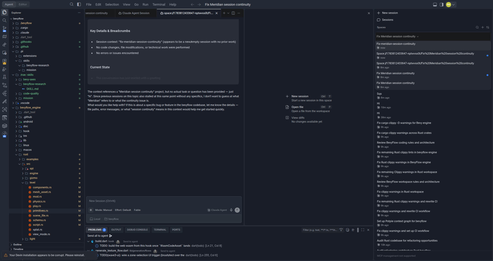

# devin-trae-ui

**Trae's polished UI, ported to your editor.** Rounded cards with real gaps,
pill-style panel tabs, 40px tab bar, Trae's typography — for
**Devin / Windsurf**, **VS Code**, **Cursor** and **Antigravity**.



Every value in the stylesheet was **measured on a live Trae instance** through
the Chrome DevTools Protocol (`getComputedStyle`, `getBoundingClientRect`) —
paddings, radii, gaps, font sizes, overlay colors. No eyeballing.

## What you get

- **Cards & gaps** — editor, sidebar, panel and agent panel become dark rounded
  cards (6px) floating on a slightly lighter chrome, separated by Trae's exact
  4px gaps. Done with `clip-path`, so VS Code's layout engine is untouched.
- **40px tab bar** — Trae's tab height, patched at the single JS constant that
  drives both layout and CSS (`EDITOR_TAB_HEIGHT`), so nothing desyncs.
- **Pill panel tabs** — PROBLEMS / OUTPUT / TERMINAL as uppercase pills,
  28px, radius 4, exactly like Trae.
- **Trae details everywhere** — activity-bar icon tiles (32×32, radius 4),
  11px bold pane headers, JetBrains Mono badges, rounded inputs/buttons/menus,
  toolbar icon hover shape, quick-input at radius 12.
- **Theme-aware** — colors come from `var(--vscode-*)`, so it follows whatever
  theme you use (screenshots use a Trae-like deep-blue dark theme).
- **Devin/Windsurf bonus** — the agent chat panel (session tabs, message
  bubbles, input card) is restyled to match Trae's chat. These rules are inert
  in other editors.
- **No "corrupt installation" warning** — the installer recomputes
  `product.json` checksums after patching.

## Install

### Linux / macOS

```bash
git clone https://github.com/remymenard/devin-trae-ui
cd devin-trae-ui
./install.sh                 # auto-detects installed editors
```

Options: `--app devin|windsurf|vscode|cursor|antigravity`,
`--path /path/to/resources/app`, `--no-tab-height`.
Use `sudo` if your editor lives in a system path (e.g. `/usr/share/code`).

### Windows (PowerShell)

```powershell
git clone https://github.com/remymenard/devin-trae-ui
cd devin-trae-ui
.\install.ps1                # auto-detects installed editors
```

Options: `-App cursor`, `-Path "C:\...\resources\app"`, `-NoTabHeight`.

Then **restart the editor**.

## Uninstall

```bash
./uninstall.sh          # Linux/macOS
.\uninstall.ps1         # Windows
```

Restores the pristine workbench CSS from the backup made at install time.

## How it works

VS Code has no supported custom-CSS hook, and the once-popular injector
extensions are abandoned. So the installer does the robust thing:

1. backs up `out/vs/workbench/workbench.desktop.main.css`,
2. appends `trae-look.css` between sentinel comments (idempotent — re-running
   replaces the block),
3. optionally rewrites the `EDITOR_TAB_HEIGHT={normal:35}` constant to `40`,
4. recomputes the SHA-256 checksums in `product.json` so the editor doesn't
   show *"Your installation appears to be corrupt"*.

## FAQ

**The editor updated and the style is gone / the corrupt warning is back.**
Updates replace the patched files. Just re-run the installer.

**Does this slow anything down?** No — it's static CSS plus one changed JS
constant. No extension host, no runtime injection.

**Which theme should I use?** Any dark theme works. The closest to Trae is a
deep-blue dark theme with `editor.background` around `#181D27` and
`activityBar.background` around `#232A35`.

**Why clip-path instead of margins for the gaps?** VS Code's grid positions
parts absolutely with inline sizes; margins shift boxes and break the layout
(we tried). `clip-path: inset(... round 6px)` is purely visual.

## Disclaimer

Not affiliated with ByteDance (Trae), Cognition (Devin/Windsurf), Microsoft
(VS Code), Anysphere (Cursor) or Google (Antigravity). This project ships only
original CSS; visual dimensions were measured from a locally running Trae
instance. Patch your editor at your own risk — `uninstall` restores everything.

## License

[MIT](LICENSE)
